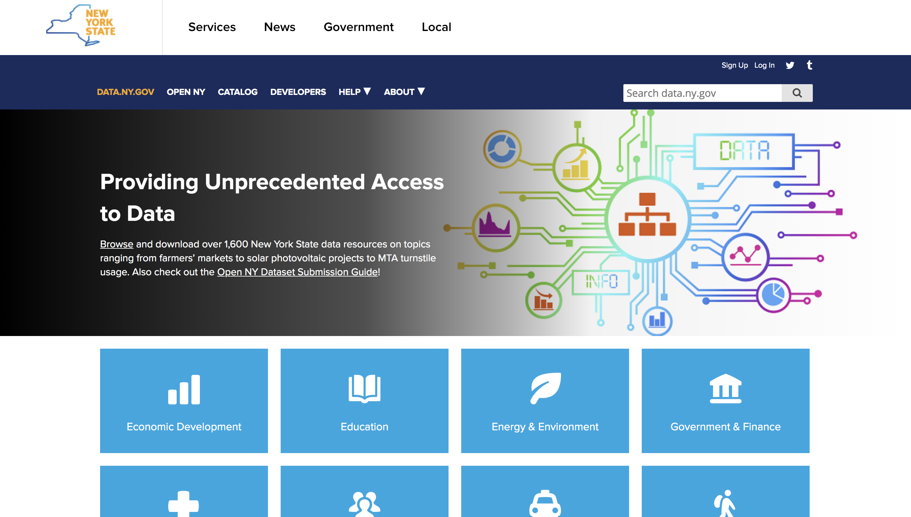
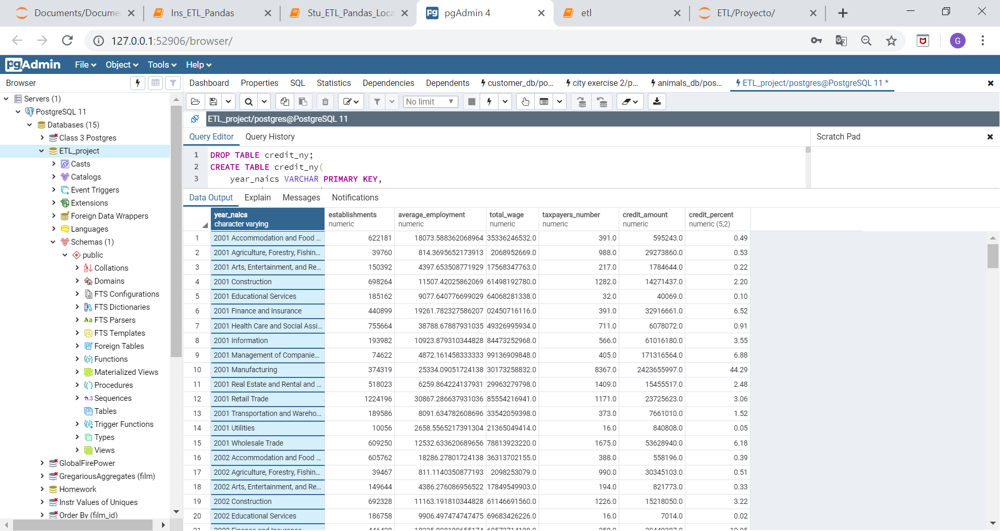
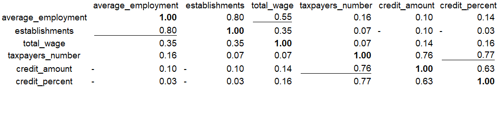

# ETL Project *by Julio Padilla and Gilberto Morales*

## New York State Datasets Merge

### Datasets Used: 

* **New York State Corporate Tax Credits by Major Industry Group:** The Quarterly Census of Employment and Wages (QCEW) program collects employment and wage data from employers covered by New York State's Unemployment Insurance Law. QCEW data encompass approximately 97 percent of New York's nonfarm employment, providing a virtual census of employees and their wages as well as the most complete universe of employment and wage data, by industry, at the State. Both in the private and the public sector. 

* **New York State Quarterly Census of Employment and Wages:** The Department of Taxation and Finance annually produces a mandated dataset of credit activity under the General Business Corporation Franchise Tax to help analyze the effects of the claims. The data used to generate this report come from an annual study file based on the latest available data drawn from New York State corporation tax returns.

## The Jupyter [Notebook](https://github.com/Axioma42/ETL_project/blob/master/etl.ipynb)

### Final Queries

## Final Database

## Conclution

